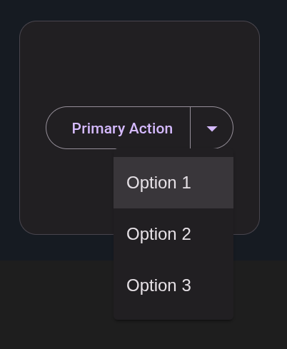

<p align="center">
  <a href="https://www.softwarity.io/">
    
  </a>
</p>

# @softwarity/split-button

<p align="center">
  <a href="https://www.npmjs.com/package/@softwarity/split-button">
    
  </a>
  <a href="https://github.com/softwarity/split-button/blob/main/LICENSE">
    
  </a>
  <a href="https://github.com/softwarity/split-button/actions/workflows/main.yml">
    
  </a>
</p>

An Angular directive that creates a [Material Design 3 split button](https://m3.material.io/components/buttons/overview) with a dropdown menu for secondary actions.

**[Live Demo](https://softwarity.github.io/split-button/)** | **[Release Notes](RELEASE_NOTES.md)**

<p align="center">
  <a href="https://softwarity.github.io/split-button/">
    
  </a>
</p>

## Features

- **Material Design 3 Compliant** - Follows M3 button specifications
- **5 Button Variants** - Text, Filled, Tonal, Outlined, Elevated
- **Responsive to Theme** - Automatically adapts to light/dark color schemes
- **Toolbar-aware** - Text & outlined variants auto-adapt their label color inside a `mat-toolbar`
- **MatMenu Integration** - Works seamlessly with Angular Material's menu component
- **Material 3 Ready** - Uses M3 design tokens for theming (`--mat-sys-*`)
- **Standalone Directive** - Easy to import in any Angular 21+ application
- **Accessible** - Keyboard navigation and ARIA support

## Installation

```bash
npm install @softwarity/split-button
```

### Peer Dependencies

| Package | Version |
|---------|---------|
| @angular/core | >= 21.0.0 |
| @angular/material | >= 21.0.0 |

## Usage

### 1. Import the directive in your component

```typescript
import { SplitButtonDirective } from '@softwarity/split-button';
import { MatMenuModule } from '@angular/material/menu';

@Component({
  selector: 'app-my-component',
  imports: [SplitButtonDirective, MatMenuModule],
  template: `...`
})
export class MyComponent {}
```

### 2. Add the `appSplitButton` directive to your button

```html
<!-- Text button (default) -->
<button appSplitButton [appSplitButtonTrigger]="trigger" (click)="onSave()">
  Save
</button>
<span [matMenuTriggerFor]="menu" #trigger="matMenuTrigger"></span>
<mat-menu #menu="matMenu">
  <button mat-menu-item (click)="onSaveAs()">Save As...</button>
  <button mat-menu-item (click)="onSaveDraft()">Save Draft</button>
</mat-menu>

<!-- Filled variant -->
<button appSplitButton="filled" [appSplitButtonTrigger]="trigger" (click)="onSubmit()">
  Submit
</button>

<!-- Outlined variant -->
<button appSplitButton="outlined" [appSplitButtonTrigger]="trigger" (click)="onAction()">
  Action
</button>

<!-- Tonal variant -->
<button appSplitButton="tonal" [appSplitButtonTrigger]="trigger" (click)="onProcess()">
  Process
</button>

<!-- Elevated variant -->
<button appSplitButton="elevated" [appSplitButtonTrigger]="trigger" (click)="onExport()">
  Export
</button>
```

## API

### Inputs

| Input | Type | Default | Description |
|-------|------|---------|-------------|
| `appSplitButton` | `'' \| 'filled' \| 'tonal' \| 'outlined' \| 'elevated'` | `''` | Button variant following Material Design 3 guidelines |
| `appSplitButtonTrigger` | `MatMenuTrigger` | `undefined` | Reference to the MatMenuTrigger for the dropdown menu |
| `disabled` | `boolean` | `false` | Whether the button is disabled |

### Button Variants

| Variant | Description |
|---------|-------------|
| Text (default) | Lowest emphasis, for less important actions |
| Filled | High emphasis, for primary actions |
| Tonal | Medium emphasis with a container color from the secondary palette |
| Outlined | Medium emphasis with a border outline |
| Elevated | Medium emphasis with a shadow elevation |

## Theming (Optional)

The directive automatically injects its styles. If you want to customize the colors, you can use the optional SCSS mixin:

```scss
@use '@softwarity/split-button/split-button-theme' as split-button;

// Customize split-button colors
@include split-button.overrides((
  filled-container-color: #ff5722,
  filled-label-color: #ffffff
));
```

### Available Tokens

The `overrides` mixin accepts a map of tokens to customize the appearance:

| Token | Default | Description |
|-------|---------|-------------|
| `text-label-color` | `var(--mat-sys-primary)` | Label color for text variant |
| `filled-container-color` | `var(--mat-sys-primary)` | Container color for filled variant |
| `filled-label-color` | `var(--mat-sys-on-primary)` | Label color for filled variant |
| `outlined-outline-color` | `var(--mat-sys-outline)` | Border color for outlined variant |
| `outlined-label-color` | `var(--mat-sys-primary)` | Label color for outlined variant |
| `tonal-container-color` | `var(--mat-sys-secondary-container)` | Container color for tonal variant |
| `tonal-label-color` | `var(--mat-sys-on-secondary-container)` | Label color for tonal variant |
| `elevated-container-color` | `var(--mat-sys-surface-container-low)` | Container color for elevated variant |
| `elevated-label-color` | `var(--mat-sys-primary)` | Label color for elevated variant |

### Adapting to the surrounding container

The transparent variants (`text` and `outlined`) inherit `--mat-toolbar-container-text-color`, so their label and chevron automatically match the text color of a surrounding `mat-toolbar` — just like a real `matButton`. Outside a toolbar they fall back to `var(--mat-sys-primary)`. The container variants (`filled`, `tonal`, `elevated`) keep their own label color over their own background. You can override any of this with the tokens above.

### Examples

```scss
// Customize filled button colors
@include split-button.overrides((
  filled-container-color: light-dark(#6750a4, #d0bcff),
  filled-label-color: light-dark(#ffffff, #381e72)
));

// Use Material 3 system colors for tonal variant
@include split-button.overrides((
  tonal-container-color: var(--mat-sys-tertiary-container),
  tonal-label-color: var(--mat-sys-on-tertiary-container)
));

// Custom brand colors
@include split-button.overrides((
  filled-container-color: #ff5722,
  filled-label-color: #ffffff
));
```

## Examples

### Save Action with Alternatives

```html
<button appSplitButton="filled" [appSplitButtonTrigger]="saveTrigger" (click)="onSave()">
  Save
</button>
<span [matMenuTriggerFor]="saveMenu" #saveTrigger="matMenuTrigger"></span>
<mat-menu #saveMenu="matMenu">
  <button mat-menu-item (click)="onSaveAs()">Save As...</button>
  <button mat-menu-item (click)="onSaveDraft()">Save Draft</button>
  <button mat-menu-item (click)="onSaveAndClose()">Save & Close</button>
</mat-menu>
```

### Export with Format Options

```html
<button appSplitButton="outlined" [appSplitButtonTrigger]="exportTrigger" (click)="onExportPDF()">
  Export PDF
</button>
<span [matMenuTriggerFor]="exportMenu" #exportTrigger="matMenuTrigger"></span>
<mat-menu #exportMenu="matMenu">
  <button mat-menu-item (click)="onExportCSV()">Export CSV</button>
  <button mat-menu-item (click)="onExportXLSX()">Export Excel</button>
  <button mat-menu-item (click)="onExportJSON()">Export JSON</button>
</mat-menu>
```

### Disabled State

```html
<button appSplitButton="filled" [appSplitButtonTrigger]="trigger" [disabled]="true">
  Disabled
</button>
```

## License

MIT
